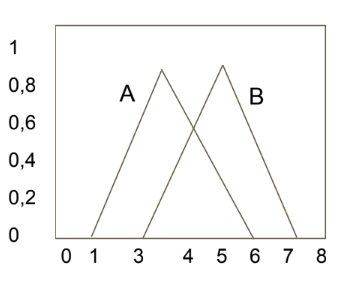

# Mate 10  

### Atividade 2 - Operações sobre conjuntos Fuzzy

Programar (em qualquer linguagem) os operadores estudados, aplicá-los sobre os conjuntos fuzzy triangulares abaixo e mostrar o conjunto fuzzy resultante.

[Consulte a Implementação](kernel.ipynb)

